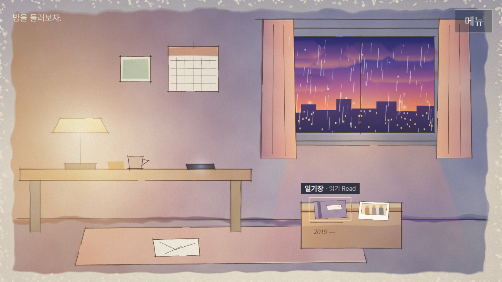
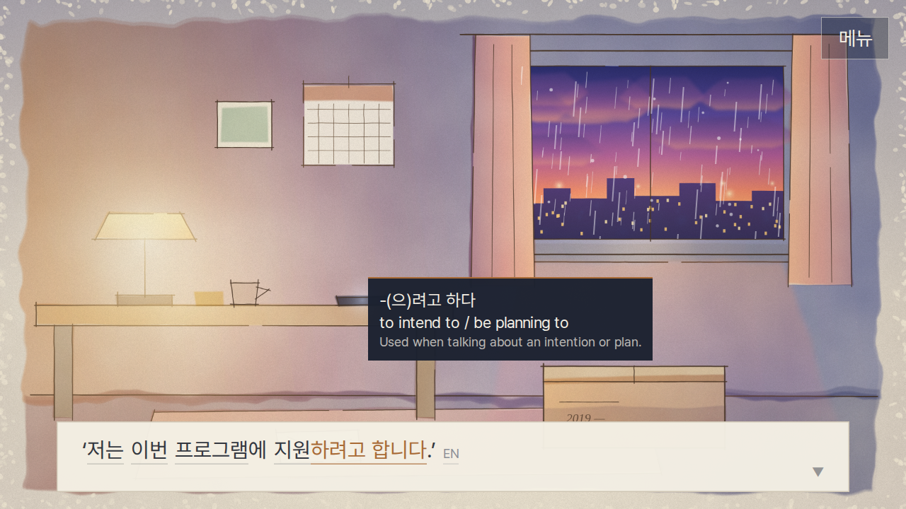

# Dear Me, / 디어 미,

A Korean-learning narrative mystery about a day that repeats. This folder is a **Unity project**
containing the first vertical slice: **Prologue (상자) + Loop 1 (나중에)**.

> 처음 해 보는 사람용 요약: Unity 6로 이 폴더를 열고 → 메뉴 **Dear Me → 1. Set Up Project** → ▶ Play.
> 웹 버전은 **Dear Me → 3. Build Web** → `Builds/WebGL` 폴더 내용을 itch.io나 GitHub Pages에 올리고 URL로 접속.

---

Preview of the present-day room (sketchbook style: pen line + watercolor wash, with paper-lantern night light):




## 1. Quick start

1. Install **Unity 6 (6000.0 LTS or newer)** with the **Web Build Support** module.
2. Unity Hub → *Add project from disk* → select this `dear-me` folder. Unity creates `ProjectSettings/`
   and `.meta` files on first open (they aren't committed yet because nothing could open Unity
   where this was written).
3. Menu **Dear Me → 1. Set Up Project**. It creates `Assets/DearMe/Scenes/Main.unity`, adds it to
   the build, applies the Web player settings below, and validates content.
4. Press **Play**. The game boots itself from code (`GameRoot`), so any scene works, even an empty one.

**Other Unity versions.** The code avoids version-specific APIs. For 2022.3 LTS, change
`com.unity.ugui` in `Packages/manifest.json` to `1.0.0`. If the project uses the Input System
package only (*Player → Active Input Handling = Input System*), it still works: input code
switches on `ENABLE_INPUT_SYSTEM`.

## 2. Web build and deployment

* Menu **Dear Me → 3. Build Web** → output in `Builds/WebGL/`.
* Settings applied by setup: Gzip compression **with decompression fallback** (works on GitHub Pages
  and itch.io, which don't send `Content-Encoding` headers), data caching on, custom template
  `Assets/WebGLTemplates/DearMe` (full-window canvas, safe areas, loading bar, no mobile warning,
  long-press doesn't open the browser context menu, DPR capped at 2).
* **Don't double-click `index.html`.** Browsers block the build from `file://` (the template shows a
  message saying so). Test locally with Unity's *Build and Run*, or any static server
  (`npx serve Builds/WebGL`, `python3 -m http.server -d Builds/WebGL`).
* **itch.io**: zip the *contents* of `Builds/WebGL`, upload as an HTML project, mark it
  *played in the browser*, set the viewport to 1280×720, and enable the fullscreen button and *Mobile friendly*.
* **GitHub Pages**: push the contents of `Builds/WebGL` to a `gh-pages` branch (or `/docs`) and enable Pages.
* No backend: saves are browser-local (PlayerPrefs → IndexedDB).

## 3. What's in the slice

| Requirement | Where |
|---|---|
| Main menu, continue/new, settings, pause | `UI/Screens.cs`, `Core/GameRoot.cs` |
| Present-day room, 8 objects (≥5 interactive), box → diary/photo | `Data/rooms.json`, `UI/RoomView.cs` |
| Diary (`-(으)ㄹ까 말까` in context, no lecture) | `Data/documents.json` → `diary_20191003` |
| Photo → past transition, subtle (dim/bleach, no portal) | `UI/Overlays.cs` `ScreenFader` |
| Yuri / Yunji / Hyejin café scene with the required lines | `Data/story_slice.json` `l1_*` |
| Application notice with a coffee stain (the information gap is physical) | `notice_exchange_2020` |
| `-(으)려고 하다` full pipeline: recognition → meaning → substitution → order → transform → negative → context → guided production → communicative use → delayed recycling | `Data/drills.json`, story nodes `l1_d_*`, `l1_c4`, `st_2`, `nt_msg`, `nt_c` |
| Matching + reading comprehension on the notice | `d_notice_match`, `d_comp_*` |
| Information gap #1 (deadline is under the stain; ask Hyejin, read her photo, report to Yuri) | `ig_h*`, `photo_board`, `d_report_deadline` |
| Information gap #2 with negotiation of meaning (clarify / describe / ask meaning / confirm) | `ig_c*` (stationery store) |
| Grammatical vs. natural feedback | `d_context` option *할 수 있어*, `d_production` "odd" pairs, `d_transform` alternative |
| Loop end, the note «내일은 신청하지 마.» | `nt_note` |
| Changed story state + memory | `phase:LetterFound`, `loop:end`, photo `v1 → v2`, diary changes if you almost submitted, quiet *기억이 바뀌었다 · Memory updated* |
| Save/load at stable nodes, backup slot, corrupt/old/missing saves | `Save/SaveService.cs` |
| Desktop hover / mobile tap / long press translation from one data source | `UI/TooltipController.cs`, `Language/TooltipContentBuilder.cs` |
| Support levels OFF / LOW / FULL | Settings; FULL adds inline glosses under grammar and level ≥3 vocabulary |

Content volume: **274 Korean lines** across dialogue, documents, drills and photos; a single
playthrough shows 88+ dialogue lines and `-(으)려고 하다` 10+ times in different contexts
(the content test enforces both).

## 4. Architecture

```
Assets/DearMe/
  Scripts/
    Content/   data models, KoreanMarkup parser, ContentDatabase, ContentSanitizer     (pure C#)
    Story/     StoryState, StoryStateManager (conditions/effects), TimeLoopManager,
               StoryRunner (graph walker, "DialogueManager")                               (pure C#)
    Language/  PatternTracker (exposure → mastery), DrillEvaluator, TooltipContentBuilder (pure C#)
    Save/      SaveService (versioned, primary + backup)                                   (pure C#)
    Input/     InputGate (Idle/Displaying/WaitingForInput/Choice/Transitioning/Locked)    (pure C#)
    Settings/  GameSettings                                                                (pure C#)
    Layout/    FlowLines (line breaking for token flows)                                   (pure C#)
    Platform/  Unity adapters: ContentLoader (Resources+JsonUtility), PlayerPrefsStorage,
               InputAdapter (legacy or Input System)
    UI/        views built from code: Dialogue, Choices, Room, Document, Photo, Drill, Tooltip,
               FlowLayoutGroup, KoreanTextView/TokenView, Screens, Overlays, CanvasFitters
    Audio/     AudioManager + ProceduralAudio (placeholder rain/clock/café/birds… synthesized at runtime)
    Core/      GameRoot (composition root, flow, back button, focus), StoryPresenter
  Editor/      Dear Me menu: Set Up Project, Validate Content, Build Web
  Resources/DearMe/Data/   all content (JSON)
  Resources/DearMe/Fonts/  Pretendard Regular + SemiBold (OFL), subset to KS X 1001 Hangul + Latin
Assets/WebGLTemplates/DearMe/   web page template
Tests/DearMe.Tests/   dotnet test runner: content validation + logic + 300 simulated playthroughs
Tests/TypeCheck/      compiles every script against Unity API stubs (both input back-ends)
```

* **Content ↔ logic ↔ presentation are separate.** The StoryRunner only knows `IStoryPresenter`;
  views know nothing about story rules; content never lives in C#.
* **No singletons besides the self-booting root.** Services are created in `GameRoot` and passed in.
* **No scene or prefab references.** All UI is built in code (`UIFactory`), so nothing can come
  unlinked, and final art can replace `BackgroundView`/`RoomView` placeholders without touching gameplay.
* **One input gate.** Every advance/choose/interact goes through `InputGate.TryConsume`, which allows
  one action per frame, ignores double-clicks (<0.18s), respects the current state, and is
  suspended while the tab/app is unfocused.

## 5. Writing content

All files are in `Assets/DearMe/Resources/DearMe/Data/`.

**Korean markup** (used in every `ko` field):

```
{신청|@신청하다}{하려고 해|#ryeogo}.      vocab link + grammar link, glued = one unbreakable unit
{이번 주에|this week}                    word with a gloss
{에|at|PARTICLE}                         explicit type (WORD, PARTICLE, GRAMMAR, PHRASE)
{하다가|while ~ing|GRAMMAR|-다가: …}     extra text becomes the explanation
plain words                              shown, untranslated; hovering them shows the sentence translation
$plan$                                   story variable (e.g. the sentence the player built)
```

**Story nodes** (`story_slice.json`): `line`, `choice`, `drill`, `document`, `photo`, `explore`,
`transition`, `branch`, `effect`, `return`, `end`. Omit `next` to continue with the following node.

* Conditions: `flag:x`, `!flag:x`, `clue:x`, `var:x`, `loop>=N`, `inspected>=N`, `phase>=LetterFound`
* Effects: `set:x`, `unset:x`, `clue:x`, `var:x=…`, `phase:…`, `chapter:N`, `loop:N`, `loop:end`
  (clears `loop.*` flags), `use:patternId`, `photo:id=state`, `notify:memory`, `sfx:name`, `ending:x`

**Patterns** (`grammar.json`) follow the design's model (`patternId`, `meaning`, `exampleSentences`,
`substitutionWords`, `negativeForm`, `transformationRules`, `drillTemplates`, `recyclingChapters`);
all curriculum patterns for chapters 1–5 are already listed. Exposure/recognition/production/use
counts and the mastery state (`INTRODUCED → … → MASTERED`) are tracked in the save, never shown as a score.

**Drill kinds** (`drills.json`): `meaning`, `comprehension`, `context`, `substitution`, `order`,
`transform`, `negative`, `production`, `match`. Feedback is a short spoken line (*맞아.*, *거의 맞았어.*,
*이 상황에서는 …*) plus why; after a few misses the answer is shown and the story continues.

After editing content run the tests (below) — they catch broken ids, unknown vocab/patterns,
unreachable nodes, unbuildable answers, and **any character missing from the bundled font subset**.
If you need rarer Hangul, re-subset the fonts from the originals (npm package `pretendard`, `dist/public/static/alternative/*.ttf`).

## 6. Tests (no Unity needed)

```
cd Tests/DearMe.Tests && dotnet run          # 126k checks: content, drills, saves, 300 playthroughs
cd Tests/TypeCheck && dotnet build           # type-check all scripts (legacy input)
cd Tests/TypeCheck && dotnet build -p:InputSystem=true
```

CI runs the same on every push (`.github/workflows/dear-me.yml`).

## 7. Edge-case pass — status

Verified by automated tests here:

* Dialogue: double/rapid clicks and taps, same-frame duplicates, choices during transitions, input
  while unfocused (`InputGate` tests); missing translation / missing tokens / mixed scripts /
  numbers / punctuation (markup + tooltip fallback); duplicate presenter callbacks are ignored by
  the runner (playthroughs call every callback twice on a third of runs).
* Save: missing, corrupt primary (backup restore), both corrupt, old version (migrated), newer
  version (rejected), resume from a random checkpoint and finish (60 runs), new-game reset, flush
  after every checkpoint (refresh/close safe).
* Content: every node reachable, every reference valid, every answer buildable, every glyph in the font.

Handled in code but **needs a check in the Unity editor / real browsers** (nothing could run Unity here):

* Tooltip: hover delay and no-flicker switching, clamp to safe area, flip above/below, avoid the
  choice list, reposition on resize, tap-elsewhere dismiss that doesn't advance dialogue, long press.
* Layout: long Korean/English lines, text-size setting (scales the whole UI), portrait/landscape,
  ultra-wide, notches (`Screen.safeArea`), 44pt touch targets on touch devices.
* Browser: tab blur/resume, loading failure messages, `file://` warning, mobile Safari/Chrome.
* Android Back (= Escape): closes tooltip → dialog → settings → pause → reference paper; never
  exits from gameplay; on the title asks before quitting (Android build only).

Known limitations: placeholder art (flat shapes) and synthesized placeholder audio; no music beyond
a soft title pad; Korean text entry is intentionally not required (production uses guided pieces).

## 8. Art

Scenes are painted in code and exported as PNGs into `Resources/DearMe/Art`; a location or room
object with an `image` field shows that painting, otherwise flat placeholder shapes are drawn.
The look combines three lemo-opuscar styles: Urban Sketch (wobbly sepia fineliner, misregistered
wash, page edge fraying into paper), Watercolor (cream cold-press paper, uneven pigment, dried edges,
granulation) and Paper Lantern (warm glowing lamp and city lights at night).
Rules: [`ArtSource/ART_DIRECTION.md`](ArtSource/ART_DIRECTION.md) — always gradients and rich color; skies and warm light come first.

```
node ArtSource/render.js        # re-paint after editing ArtSource/*.html (needs Playwright)
```

## 9. Licenses

Fonts: Pretendard by Kil Hyung-jin, SIL Open Font License 1.1 (see `OFL-Pretendard.txt` next to the font files).
