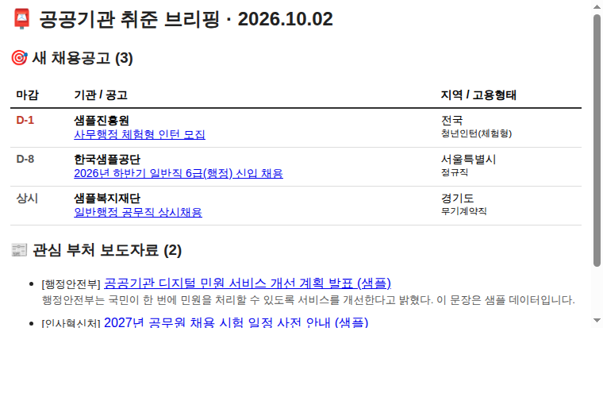

# 📮 공공기관 취준 데일리 브리핑

매일 아침 **새 공공기관 채용공고**와 **관심 부처 보도자료**를 모아서 이메일 한 통으로 보내주는 자동화 파이프라인입니다.



## 1. 문제 정의

공공기관 취업을 준비하면서 매일 반복하던 일이 있었습니다.

- 채용 포털에 들어가서 새 공고가 올라왔는지 확인하기
- 수백 건 중에서 내 직무(행정·사무)와 지역에 맞는 공고 골라내기
- 마감일을 따로 메모해 두고 놓치지 않게 챙기기
- 면접 준비를 위해 관심 기관 관련 부처의 보도자료 훑어보기

매일 하는 일인데 판단이 거의 필요 없고, 깜빡하면 공고를 놓칩니다. **사람이 매일 직접 할 필요가 없는 일**이라고 판단해 자동화했습니다.

## 2. 동작 방식

```
GitHub Actions (매일 06:52 KST)
   │
   ├─ ① 수집   공공데이터포털 API ─ 공공기관 채용정보(JSON) + 정책브리핑 보도자료(XML)
   ├─ ② 필터   config.toml의 직무 키워드 · 지역 · 관심 부처로 거르기 (규칙 기반)
   ├─ ③ 중복제거 state.json에 기록된 "이미 보낸 항목" 제외
   ├─ ④ 마감알림 예전에 받은 공고 중 마감 3일 이내인 것 다시 알려주기
   ├─ ⑤ (선택) AI 3줄 요약 ─ Gemini 무료 티어, 꺼져 있어도 정상 동작
   ├─ ⑥ 발송   Gmail SMTP로 HTML 메일 1통
   ├─ ⑦ 기록   발송 성공 시에만 state.json 갱신
   └─ ⑧ 로그   logs/runs.jsonl에 실행 결과(수집 건수, 실패 원인) 기록 후 커밋
```

| 파일 | 역할 |
|---|---|
| `jobdigest/sources.py` | API 호출과 응답 파싱 |
| `jobdigest/filters.py` | 내 조건 필터 |
| `jobdigest/state.py` | 보낸 항목 기록, 마감 임박 계산 |
| `jobdigest/render.py` | 메일 본문 (HTML + 텍스트) |
| `jobdigest/mailer.py` | Gmail 발송 |
| `jobdigest/summarize.py` | (선택) AI 요약 |
| `config.toml` | 내 조건 설정 |

## 3. 설계에서 고민한 점

**① 개인정보를 다루지 않는다.**
입력은 전부 공개 데이터(공공데이터포털)입니다. AI 요약을 켜더라도 외부로 나가는 정보는 공고 제목과 보도자료 제목뿐입니다.

**② AI는 꼭 필요한 곳에만 쓴다.**
채용공고는 이미 구조화된 데이터라서 필터링에 AI가 필요 없습니다. 규칙 기반으로 처리하면 결과가 매번 같고, 테스트할 수 있고, 비용이 0원입니다. AI는 "오늘의 3줄 요약"이라는 부가 기능에만 선택적으로 붙였고, 실패해도 메일은 정상 발송됩니다.

**③ 조용히 실패하지 않는다.**
- 한 소스가 실패해도 나머지는 발송하고, 메일 하단에 **"⚠️ 수집 실패"**로 원인을 표시합니다.
- 메일 발송이 **성공한 뒤에만** "보낸 항목"을 기록합니다. 발송이 실패한 날의 공고는 다음 날 다시 갑니다.
- 발송 실패 시 워크플로가 빨간색(실패)이 되고, GitHub이 실패 알림 메일을 보내줍니다.
- 새 소식이 없는 날에도 "새 소식 없음" 메일을 보내서 시스템이 살아 있는지 알 수 있습니다.

**④ 운영 비용 0원.**

| 구성 요소 | 도구 | 비용 |
|---|---|---|
| 데이터 | 공공데이터포털 Open API | 무료 |
| 스케줄러 | GitHub Actions | 무료 (하루 1~2분 실행) |
| 메일 | Gmail SMTP + 앱 비밀번호 | 무료 |
| 저장소 | Git에 커밋되는 `state.json` | 무료 |
| AI 요약 (선택) | Gemini API 무료 티어 | 무료 |

외부 라이브러리 없이 Python 표준 라이브러리만 사용해서 설치 단계도 없습니다.

## 4. 설정 방법

### ① 공공데이터포털 인증키 받기
1. [data.go.kr](https://www.data.go.kr) 가입
2. 아래 두 API를 각각 **활용신청** (보통 자동승인, 키가 동작하기까지 1~2시간 걸릴 수 있음)
   - 공공기관 채용정보 조회서비스 (`apis.data.go.kr/1051000/recruitment`)
   - 문화체육관광부_정책브리핑_보도자료 (`apis.data.go.kr/1371000/pressReleaseService`)
3. 마이페이지에서 **일반 인증키(Decoding)** 복사 (Encoding 키를 넣어도 자동 처리됩니다)

### ② Gmail 앱 비밀번호 만들기
1. Google 계정에서 **2단계 인증** 켜기
2. Google 계정 → 보안 → **앱 비밀번호**에서 16자리 비밀번호 생성

### ③ GitHub Secrets 등록
저장소 → Settings → Secrets and variables → Actions → **New repository secret**

| 이름 | 값 |
|---|---|
| `DATA_GO_KR_KEY` | 공공데이터포털 인증키 |
| `GMAIL_USER` | 보내는 Gmail 주소 |
| `GMAIL_APP_PASSWORD` | 앱 비밀번호 16자리 |
| `MAIL_TO` | (선택) 받는 주소. 없으면 `GMAIL_USER`로 보냄 |
| `GEMINI_API_KEY` | (선택) AI 요약용. `config.toml`의 `[ai] enabled = true`와 함께 사용 |

### ④ 내 조건 수정
`config.toml`에서 직무 키워드, 지역, 관심 부처를 바꾸세요.

### ⑤ 실행 확인
- Actions 탭 → **job-digest** → **Run workflow** → `dry_run` 체크 → 실행하면 메일 대신 미리보기 HTML이 아티팩트로 올라옵니다.
- 문제없으면 `dry_run` 없이 한 번 실행해서 메일이 오는지 확인하세요.
- ⚠️ GitHub의 예약 실행(cron)은 **기본 브랜치(main)에 있는 워크플로만** 동작합니다.

## 5. 로컬 실행

```bash
cd job-digest
python -m jobdigest run --demo          # API 키 없이 샘플 데이터로 미리보기 → out/preview.html
python -m unittest discover -s tests    # 테스트

export DATA_GO_KR_KEY=...               # 실제 데이터
python -m jobdigest probe recruit       # API 원본 응답 확인 (필드명이 바뀌었을 때)
python -m jobdigest run --dry-run       # 실제 수집, 메일은 안 보냄
```

`tests/fixtures`의 데이터는 **가상의 샘플**입니다 (실제 기관·공고 아님).

## 6. 효과 측정 (진행 예정)

| 지표 | 자동화 전 | 자동화 후 |
|---|---|---|
| 하루 공고·보도자료 확인 시간 | _측정 예정_ | _측정 예정_ |
| 마감을 놓친 관심 공고 수 | _측정 예정_ | _측정 예정_ |
| 수집 성공률 | — | `logs/runs.jsonl`에서 집계 |

2주 동안 직접 사용하면서 기록할 예정입니다.

## 7. 한계와 다음 단계

- 공공데이터 API의 응답 형식이 바뀌면 파싱이 깨질 수 있습니다. 그래서 `probe` 명령으로 원본을 바로 확인할 수 있게 했고, 실패는 메일에 표시됩니다.
- 공고 상세 내용(자격요건, 전형 절차)은 아직 가져오지 않습니다. 다음 단계에서 상세 API와 첨부파일 요약을 검토할 예정입니다.
- 마감일 일정을 캘린더 파일(.ics)로 첨부하는 기능을 추가할 수 있습니다.
